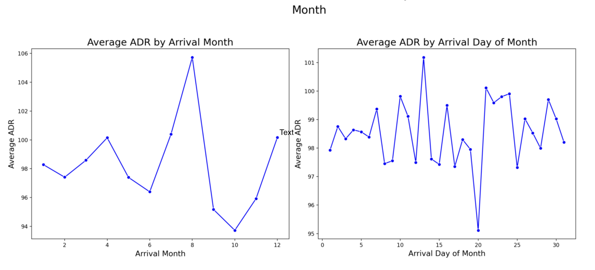
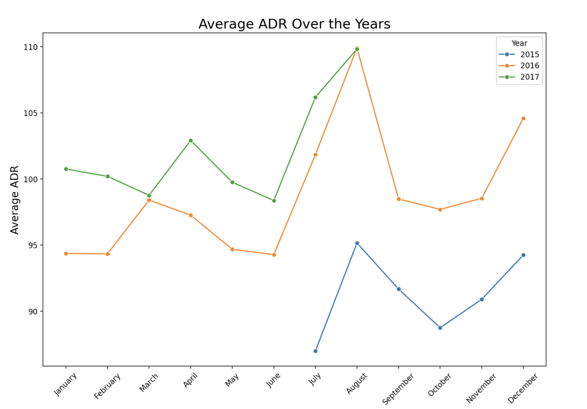
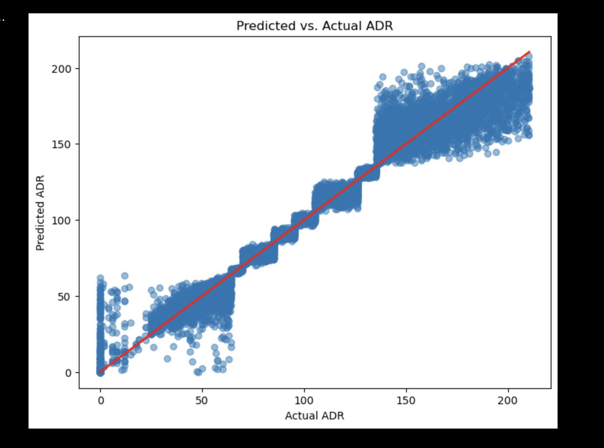

<!-- Top Visualizations -->

    <h2>Visualizations</h2>
    

        <!-- App Photos -->
        

            
            
ADR by Month

        

        

            
            
ADR by Year

        

        

            
            
Type of Guests

        

        <!-- Model Performance Photos -->
        

            
            
Performance Mean-Median Difference 1

        

        

            
            
Performance Mean-Median Difference 2

        

        

            
            
Visualization of Performance

        

    

<!DOCTYPE html>
<html lang="en">
<head>
    <meta charset="UTF-8">
    <title>Hotel Booking Data Analysis & ADR Prediction</title>
</head>
<body>

<h1>Hotel Booking Data Analysis & ADR Prediction</h1>

This project focuses on analyzing <strong>hotel booking data</strong> and predicting the <strong>Average Daily Rate (ADR)</strong> for hotel reservations using <strong>machine learning</strong>. It provides insights into factors affecting hotel pricing and supports <strong>data-driven revenue management</strong>.

<h2>Project Overview</h2>

The analysis evaluates how various features influence ADR, including:

<ul>
    <li><strong>Stay Duration:</strong> Weekday and weekend nights.</li>
    <li><strong>Lead Time:</strong> Days between booking and arrival, categorized into quartiles.</li>
    <li><strong>Room Type:</strong> Categorized into ADR bins (Low, Medium, High).</li>
    <li><strong>Guest Composition:</strong> Number of adults, children, and babies.</li>
    <li><strong>Market Segment & Distribution Channel:</strong> Encoded and binned for predictive modeling.</li>
    <li><strong>Meal Plan:</strong> Numerically encoded.</li>
    <li><strong>Country:</strong> ADR quantiles per country.</li>
    <li><strong>Deposit Type:</strong> Encoded for model input.</li>
</ul>

The goal is to <strong>predict ADR for future bookings</strong> and provide actionable insights for pricing strategy optimization.

<h2>Data Preprocessing</h2>

Key preprocessing steps:

<h3>1. Feature Engineering</h3>
<ul>
    <li>Lead Time binned by quartiles.</li>
    <li>ADR dynamically binned using percentiles.</li>
    <li>Meal plans and deposit types numerically encoded.</li>
    <li>Country-specific ADR quantiles merged.</li>
    <li>Market segment and distribution channel merged with ADR bins.</li>
    <li>Room types categorized based on ADR averages.</li>
</ul>

<h3>2. Data Cleaning</h3>
<ul>
    <li>Redundant columns (<code>country</code>, <code>market_segment</code>, <code>distribution_channel</code>, <code>reserved_room_type</code>) removed.</li>
</ul>

<h2>Machine Learning Model</h2>

A <strong>Random Forest Regressor</strong> is used for ADR prediction:

<h3>1. Model Training</h3>
<pre><code>
rf_model = RandomForestRegressor(n_estimators=100, random_state=42)
rf_model.fit(X_train, y_train)
y_pred_rf = rf_model.predict(X_test)
</code></pre>

<h3>2. Evaluation</h3>
<ul>
    <li>RMSE and R² metrics assess model performance.</li>
    <li>Predictions appended to the dataset for further analysis.</li>
</ul>

<h3>3. Feature Alignment</h3>

Ensure input data columns match the trained model’s expected features.

<h2>Insights & Applications</h2>

<ul>
    <li>Identifies key drivers of ADR:
        <ul>
            <li>Booking lead time</li>
            <li>Stay duration</li>
            <li>Market segment and distribution channel</li>
            <li>Room type and guest composition</li>
        </ul>
    </li>
    <li>Supports <strong>dynamic pricing</strong> and <strong>revenue optimization</strong>.</li>
    <li>Can be integrated into an <strong>interactive Streamlit dashboard</strong> for real-time predictions.</li>
</ul>

<h2>Installation</h2>

<ol>
    <li>Clone the repository:
        <pre><code>git clone &lt;repo-url&gt;</code></pre>
    </li>
    <li>Install dependencies:
        <pre><code>pip install -r requirements.txt</code></pre>
    </li>
    <li>Run the Streamlit app:
        <pre><code>streamlit run Hotel_prediction_app_code.py</code></pre>
    </li>
</ol>

<h2>Contributing</h2>

Contributions are welcome for improvements in:

<ul>
    <li>Data preprocessing</li>
    <li>Feature engineering</li>
    <li>Model performance</li>
    <li>Visualization and dashboard features</li>
</ul>

Please submit pull requests with clear documentation.

<h2>License</h2>

This project is open-source and available for educational and research purposes.

</body>
</html>
